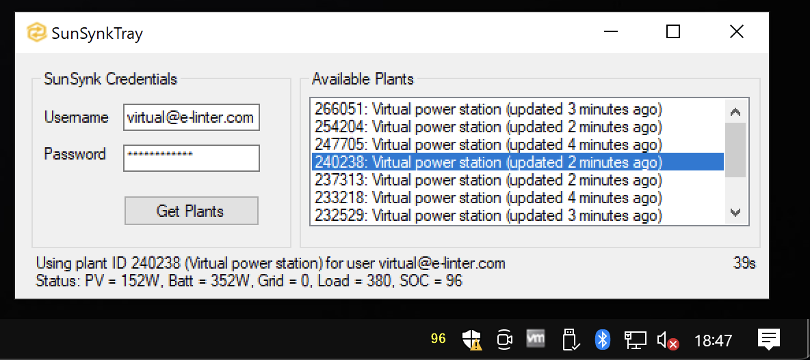
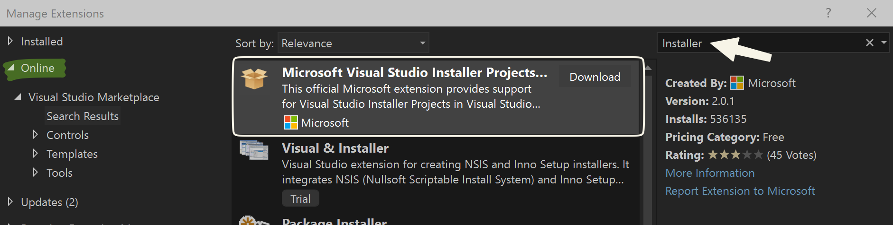

# sunsynktray-win

A small, .NET Framework tray icon application to monitor SunSynk plants' state of charge, for Windows.

## installation

Check out the latest release Assets for `SunSynkTrayInstaller.zip`. This installer should install the app in your local `%AppData%` folder. Once installed, search for `SunSynkTray` in your start menu, and open the settings menu from the tray icon that should appear.

## development

This is a .NET Framework 4.8 app that uses the Visual Studio Installer Extension. Make sure you have the .NET utilities for Desktop development installed. In addition (and for some reason), if you load the project before having the Visual Studio Installer extention installed, the installer project will refuse to load. So, make sure thats installed before you load.

