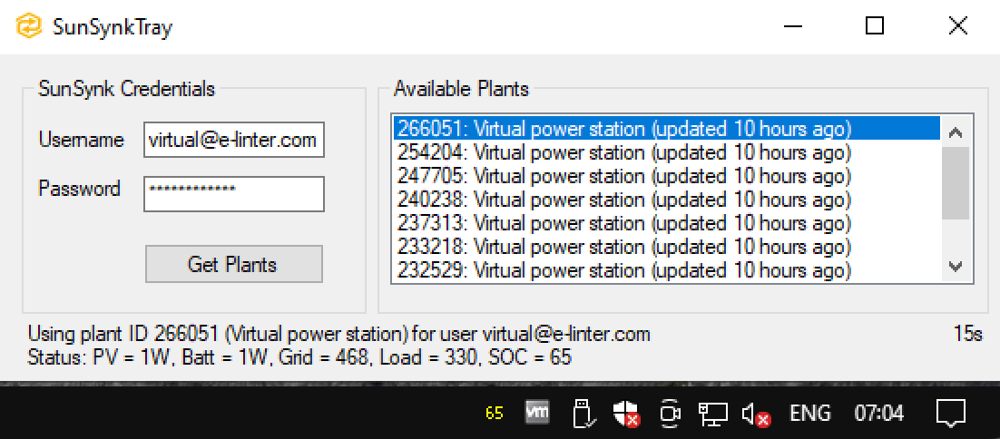

# sunsynktray-win

A small, .NET Framework 4.8 SunSynk tray icon application to monitor plants' state of charge, for Windows.

## installation

Check out the latest release Assets for `SunSynkTrayInstaller.zip`. This installer should install the app in your local `%AppData%` folder. Once installed, search for `SunSynkTray` in your start menu, and open the settings menu from the tray icon that should appear.
